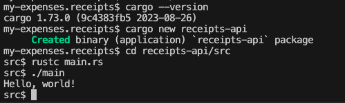

# my-expenses.receipts

Install rust
```
curl --proto '=https' --tlsv1.2 -sSf https://sh.rustup.rs | sh
```

Add following lines to `~/.zshrc`` file to include rust binaries
```
export PATH="$PATH:~/.cargo/bin"
```

Load `~/.zshrc` profile
```
source ~/.zshrc
```

Create new rust app
```
cargo new receipts-api
```

You should have hello world example ready.

Move to project folder and compile main.rs file
```
cd receipts-api/src
rustc main.rs
```

execute binary
```
./main
```



Add dependencies to `Cargo.toml` file
```
[package]
name = "receipts-api"
version = "0.1.0"
edition = "2021"

# See more keys and their definitions at https://doc.rust-lang.org/cargo/reference/manifest.html

[dependencies]
postgres = "0.19"
postgres = "0.19"
serde = "1.0"
serde_json = "1.0"
serde_derive = "1.0"
```

Add logic to main.rc

Create docker files
```
touch .dockerignore Dockerfile docker-compose.yml
```

inside dev container

install dependencies and build debug binary
```
cargo build
```

run debug compiled binary
```
cargo run
```

reference: https://dev.to/francescoxx/rust-crud-rest-api-3n45